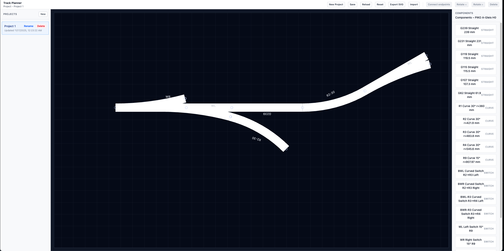

# Track Planner (Prototype)

This is Phase 2 of a browser-only H0 track-planning canvas. It now introduces Tailwind CSS v4, multi-project persistence, and the complete toolbar/sidebar/canvas shell; track geometry, snapping, and SVG export remain future work.





## Getting started

```bash
npm install
npm run dev
```

## Phase 2 highlights

- Tailwind CSS v4 setup with a single CSS entrypoint that powers the entire layout.
- Multi-project support stored in `localStorage`, including create, rename, delete, and reload.
- Toolbar with stubbed actions (New, Save, Reload, Reset, Export, Import).
- Left projects sidebar and right components sidebar that wrap the generic `TrackSystemDefinition`.
- Central canvas that can render placeholder `placedItems` from the active project.
- Project scaffolding still intentionally generic; geometry/snapping/export remain for future phases.
